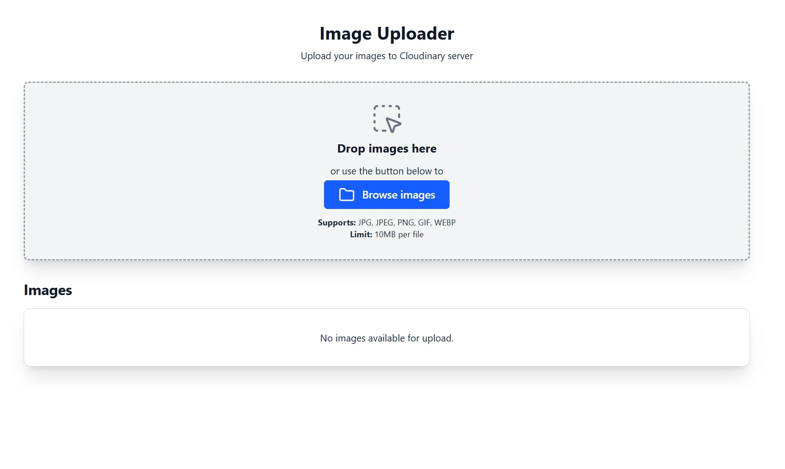
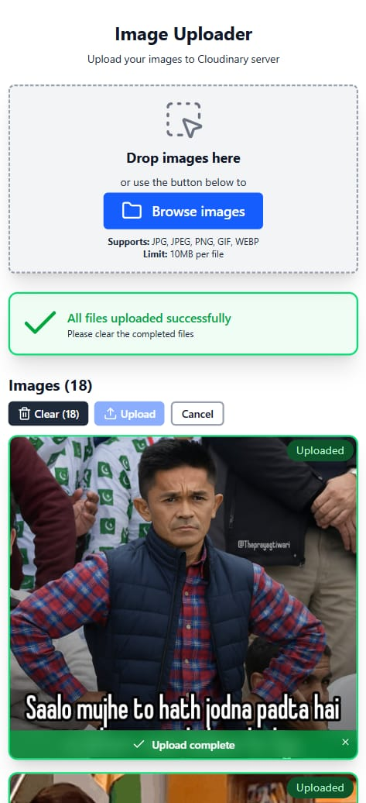

# Image Uploader

## About the Project

A modern, performant image uploader built with React, Uppy, and Cloudinary. It supports drag-and-drop, file validation, thumbnail previews, concurrent uploads, and a beautiful, responsive UI with toast notifications.

[View Demo](http://uppy-img-uploader.netlify.app)

## Features Implemented

- Drag-and-drop and file picker support
- File type and size validation (JPEG, PNG, GIF, WEBP, max 10MB)
- Async thumbnail generation with loading skeletons
- Upload progress tracking and stats
- Error handling with toast notifications
- Retry, cancel, and clear actions for uploads
- Mobile-responsive and accessible UI
- Configurable cloudinary upload credentials and settings

## Tech Stack

- React 18
- TypeScript
- Uppy (Core, XHRUpload, ThumbnailGenerator)
- Cloudinary (Image Hosting)
- Tailwind CSS with Class Variance Authority (CVA)
- Framer motion
- Lucide SVG icons
- Vite (Build and Deployment)

## Getting Started

### Prerequisites

- Node.js (v16 or higher)
- npm or yarn

### Setup & Installation

```sh
# Clone the repository
git clone https://github.com/AshBardhan/image-uploader.git
cd image-uploader

# Install dependencies
npm install

# Configure Cloudinary credentials (required)
cp .env.example .env

# Update environment variables with your Cloudinary endpoint and upload preset:
VITE_CLOUDINARY_ENDPOINT=https://api.cloudinary.com/v1_1/<your-cloud-name>/image/upload
VITE_CLOUDINARY_UPLOAD_PRESET=<your-upload-preset>

# Run development server
npm run dev

# Build for production
npm run build

# Preview production build
npm run preview

# Optimize images in screenshots folder (for documentation purposes only)
npm run optimize:images
```

Open `http://localhost:5173` in your browser to view the application.

## Project Structure

```text
image-uploader/
├── public/                        # Static assets (favicon, images, etc.)
├── src/                           # Source code root
│   ├── components/                # UI components (atomic design)
│   │   ├── atoms/                 # Smallest UI elements
│   │   ├── molecules/             # Compound components
│   │   ├── organisms/             # Complex UI blocks
│   │   ├── templates/             # Page-level or composite UI templates
│   ├── constants/                 # App-wide constants
│   ├── contexts/                  # React context providers
│   ├── hooks/                     # Custom React hooks
│   ├── types/                     # TypeScript type definitions
│   ├── utils/                     # Utility/helper functions
│   ├── App.tsx                    # Main app component
│   ├── index.css                  # Global styles (Tailwind)
│   ├── main.tsx                   # App entry point (ReactDOM.render)
├── eslint.config.js               # ESLint configuration
├── index.html                     # HTML entry point
├── package.json                   # Project metadata and dependencies
├── tsconfig.json                  # TypeScript configuration (base)
├── vite.config.ts                 # Vite build tool configuration
```

## Architectural Decisions

| Decision | Purpose | Reasoning |
| ---------- | --------- | ----------- |
| Uppy | File Uploader | Robust, extensible, handles restrictions and plugins well |
| Cloudinary | File Storage | Fast, reliable, free tier, easy integration |
| Context API | Notification Management | Decoupled from UI |
| Tailwind CSS + CVA | Styling | Utility-first, scalable, easy variant management |
| Atomic Design Pattern | Component Architecture | Reusable, testable and maintainable UI components |

## Screenshots

Default View


File Added


File Uploading


File Uploaded


Tablet View


Mobile View


## Future Implementations

- Unit and Integration tests
- Dark mode support
- Drag-to-reorder for files
- Multi-language (i18n) support
